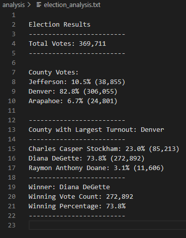

# Election Analysis

## Project Overview
A Colorado Board of Elections employee has given you the following tasks to complete the election audit of a recent local congressional election.

1. Calculate the total number of votes cast.
2. Get a complete list of candidates who received votes.
3. Calculate the total number of votes each candidate received.
4. Calculate the percentage of votes each candidate won.
5. Determine the winner of the election based on popular vote.

## Resources
- Data Source: election_results.csv
- Software: Python 3.8.6, Visual Studio Code, 1.49.3

## Summary
The analysis of the election show that:
- There were 369,711 votes cast in the election.
- The candidates were:
    - Charles Casper Stockham
    - Diana DeGette
    - Raymon Anthony Doane
- The candidate results were:
    - Charles Casper Stockham received 23% of the vote and 85,213 number of votes
    - Diana DeGette received 73.8% of the vote and 272,892 number of votes
    - Raymon Anthony Doane received 3.1% of the vote and 11,606 number of votes
- The winner of the election was:
    - Candidate Diana Degette, who received 73.8% of the vote and 272,892 number of votes.
    
## Challenge Overview
For the Challenge we delved deeper into the data and gathered information about the county voting data in addition to the candidates. What we want to know about the county data includes...

1. Get a complete list of the counties that participated in this election. 
2. Calculate the total number of votes cast in each county.
3. Calculate the percentage of votes from each county.
4. Determine which county had the largest voter turnout. 

## Challenge Summary
The analysis of the election show the following about the counties:
- There three counties that participated in this election. They were:
    - Arapahoe
    - Denver
    - Jefferson
- The county results were:
    - Jefferson county contributed 10.5% of the vote count with 38,855 votes tallied
    - Denver county contributed a whopping 82.8% of the vote count with 306,055 votes tallied
    - Arapahoe county contributed 6.7% of the vote count with 24,801 votes tallied. 
- The county with the largest voter turnout was: 
    - Denver county with 82.8% of the vote and 306,055 votes tallied
    
All results of the election for this audit are displayed in the following image: 

    
## Challenge Statement
The methods used in aggregating this voting data proved to accurately display the voting data and makes for a great template to cover future elections. Here, we can also use this template to further slice the data. If we were able to know more about county information, such as county population, we could learn which counties had the highest amount of participation in proportion to the population. This could help determine where there may exist opportunities for higher voter turnout. To do this, we would take the county population data and also throw that into our county dictionary. From there, we would change the denominator used in our `county_vote_percentage` formula from `total_votes` to `county_population` to show what percent of the population came out to vote. We would rename this variable `county_vote_turnout` This adjustment is demonstrated below:

`county_vote_percentage =  float(county_vote_count) / float(total_votes) * 100`

`county_vote_turnout = float(county_vote_count) / float(county_population) * 100`

Additionally, some counties have more population density than other counties. It's no surprise that Denver county came out on top with the most votes cast - it has Colorado's largest city, Denver, within the county limits! We could slice the location data further and instead of gaining county data, take a look at vote count by city/town instead. This information may also help determine better representation within regions on a city level, rather than on a potentially larger scaled county level. To make this adjustment, we would first need a file that included city data, then apply the same practices that were performed on county but on a city level. We would use a nested dictionary where each county then held data about all of their cities. This is demonstrated below: 

`county_list = {"county": "county_1", "cities": {"city_1": 'vote_num'}}` 
